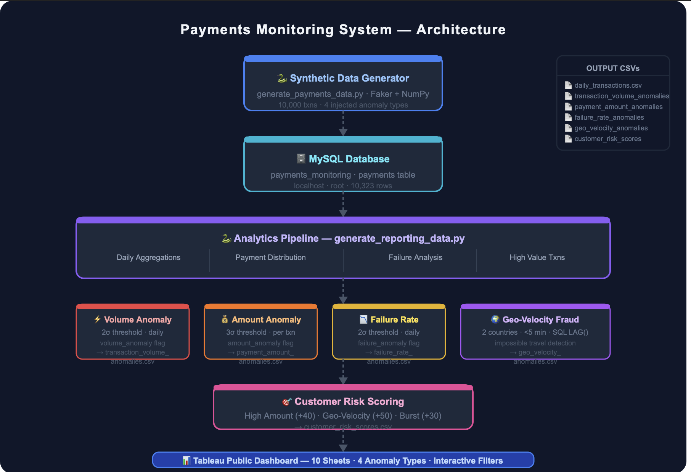
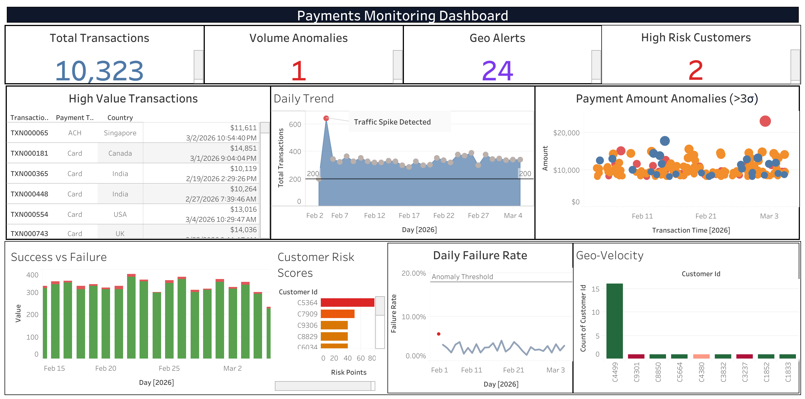

# Payments Monitoring & Fraud Detection System

A **data analytics project simulating a financial payments monitoring system** used to detect operational anomalies and fraud signals in transaction networks.

This project demonstrates how modern financial systems monitor transaction flows, detect suspicious patterns, and provide operational visibility through data pipelines and analytics dashboards.

The system generates synthetic payment transactions, processes them through an analytics pipeline, and visualizes insights using a monitoring dashboard.

---

# Project Overview

Financial institutions process millions of transactions daily. Monitoring these transactions is critical for detecting system failures, abnormal activity, and potential fraud.

This project simulates a real-world payments monitoring architecture used by financial institutions to:

- Monitor transaction volume and system health
- Detect unusual payment amounts
- Track failure rates in payment processing
- Detect geo-velocity fraud patterns
- Compute customer risk scores

The system integrates **data generation, SQL analytics, anomaly detection, and dashboard visualization** into a single analytics pipeline.

---

# Business Context

Financial institutions operate complex payment networks that must be continuously monitored for operational failures, fraud signals, and unusual transaction behavior.

Payments monitoring systems typically analyze transaction streams to detect anomalies such as:

- sudden spikes in transaction traffic
- abnormal transaction amounts
- system failure patterns
- suspicious geographic activity

This project simulates a simplified payments monitoring environment similar to those used in banks and payment networks to identify operational risks and fraud signals.

---

# System Architecture

The project is structured as a simplified but realistic **payments monitoring data pipeline**.

```
Synthetic Transaction Generator
            ↓
      Transaction Dataset (CSV)
            ↓
        MySQL Database
            ↓
     Python Analytics Pipeline
            ↓
      Anomaly Detection
            ↓
       Risk Scoring Engine
            ↓
     Monitoring Dashboard
```

## Architecture Diagram



---

# Project Structure

```
payments-monitoring-project
│
├── architecture
│   └── payments_monitoring_architecture.png
│
├── data_generator
│   └── generate-payments-data.py
│
├── analytics_pipeline
│   └── generate_reporting_data.py
│
├── datasets
│   ├── customer_risk_scores.csv
│   ├── daily_transactions.csv
│   ├── failure_rate_anomalies.csv
│   ├── failure_reasons.csv
│   ├── geo_velocity_anomalies.csv
│   ├── high_value_transactions.csv
│   ├── payment_amount_anomalies.csv
│   ├── payment_type_distribution.csv
│   ├── transaction_volume_anomalies.csv
│   └── transactions_by_country.csv
│
├── dashboard
│   └── payments_monitoring_dashboard.png
│
├── sample_data
│   └── payments_transactions_sample.csv
│
├── requirements.txt
└── README.md
```

---

# Payments Table Schema

The core transaction dataset used in the monitoring pipeline follows the schema below:

| Column | Description |
|------|-------------|
| transaction_id | Unique transaction identifier |
| customer_id | Customer identifier |
| payment_method | Payment method (Card / ACH / Wire) |
| amount | Transaction amount |
| country | Transaction origin country |
| transaction_time | Timestamp of transaction |
| status | Transaction status (Success / Failure) |

This schema represents the base structure of the payments dataset used throughout the monitoring pipeline for anomaly detection, aggregation analysis, and risk scoring.

---

# Monitoring Dashboard

The analytics outputs are visualized through a payments monitoring dashboard.

The dashboard provides operational visibility into system activity and fraud signals.

Key dashboard metrics include:

- total transactions processed  
- volume anomalies detected  
- geo-velocity alerts  
- high-risk customers  

Operational insights displayed:

- daily transaction trends  
- success vs failure analysis  
- payment amount anomaly detection  
- geo velocity monitoring  
- customer risk scoring  

---

# Dashboard Preview



---

# How to Run the Project

## 1. Install Dependencies

```
pip install -r requirements.txt
```

---

## 2. Generate Synthetic Payment Data

```
python data_generator/generate-payments-data.py
```

This script generates synthetic payment transactions and injects realistic anomalies.

---

## 3. Load Data into MySQL

Create a database:

```
CREATE DATABASE payments_monitoring;
```

Load the generated dataset into the database.

---

## 4. Run the Analytics Pipeline

```
python analytics_pipeline/generate_reporting_data.py
```

This script performs:

- anomaly detection  
- risk scoring  
- reporting dataset generation  

---

# Example Output

Example customer risk scores generated by the analytics pipeline:

| Customer ID | Risk Score |
|-------------|-----------|
| C5364 | 80 |
| C9306 | 50 |
| C8829 | 30 |

Higher scores indicate customers triggering multiple fraud signals.

---

## Sample Generated Insights

Example insights detected by the monitoring system:

| Metric | Observation |
|------|-------------|
| Transaction Spike | Abnormal transaction volume detected on a specific day |
| Failure Rate Spike | Temporary spike in payment failures detected |
| Geo Velocity Alerts | Customers appearing across multiple countries within minutes |
| High Risk Customers | Accounts flagged by aggregated anomaly signals |

These signals simulate how monitoring systems surface operational and fraud anomalies in payment networks.

---

# Example Analytical Queries

Detect transaction spikes:

```sql
SELECT
DATE(transaction_time) AS day,
COUNT(*) AS total_transactions
FROM payments
GROUP BY DATE(transaction_time)
ORDER BY total_transactions DESC;
```

Detect high value transactions:

```sql
SELECT
transaction_id,
amount
FROM payments
WHERE amount > 20000;
```

Detect geo velocity anomalies:

```sql
SELECT
customer_id,
country,
LAG(country) OVER (
PARTITION BY customer_id
ORDER BY transaction_time
)
FROM payments;
```

---

# Why This Project Matters

Financial institutions require robust monitoring systems to detect abnormal activity and ensure transaction reliability.

This project demonstrates core capabilities used in financial data analytics roles:

- data pipeline design  
- anomaly detection  
- transaction monitoring  
- fraud signal identification  
- analytics dashboard development  

These capabilities are relevant for roles in banking, fintech, and payment infrastructure analytics.

---

---

## Reproducibility

To reproduce the full monitoring pipeline:

1. Generate synthetic transactions

```
python data_generator/generate-payments-data.py
```

2. Load the generated dataset into MySQL.

3. Run the analytics pipeline

```
python analytics_pipeline/generate_reporting_data.py
```

4. Open the Tableau dashboard and connect it to the generated datasets.

The dashboard will automatically visualize anomaly signals, transaction patterns, and customer risk scores.

# Potential Future Improvements

Possible extensions to this project:

- real time transaction monitoring with streaming pipelines  
- machine learning based fraud detection  
- automated alerting systems  
- network analysis for fraud rings  
- deployment using cloud infrastructure  

---

# Author

Shubham Singh  
Process Analyst | Data Analytics  

Focus areas:

- financial analytics  
- payments monitoring  
- anomaly detection  
- fraud analytics  
