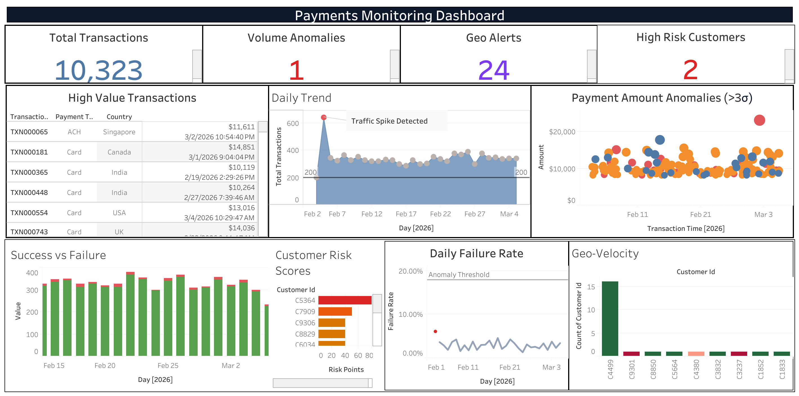

# Payments Monitoring & Fraud Detection System

Synthetic payments monitoring workflow for volume anomalies, failure rates, high-value transfers, geo-velocity alerts, and customer risk scores.

<!-- FOUNDER_OS_STANDARD_README -->

## Portfolio role

This is an older payments risk analytics project using synthetic data. It is useful for showing anomaly-style monitoring, risk scoring, and dashboard-ready outputs, but it should stay secondary to the stronger Founder OS and operator-system repos.

## The founder problem

Payments teams need to know when transaction volume, payment failures, high-value transfers, geo-velocity behavior, or customer risk patterns move outside normal bounds before they become customer or compliance escalations.

## What this repo does

- generates synthetic payment transactions
- creates monitoring datasets
- flags anomaly-style patterns
- exports dashboard-ready tables and preview image

## What a founder gets in 10 minutes

- synthetic transactions
- daily transaction summary
- failure-rate anomalies
- high-value transaction list
- geo-velocity alerts
- customer risk scores
- dashboard preview

## Before and after

Before:

- raw transactions without monitoring layer
- late failure-rate visibility
- manual anomaly review
- unclear customer risk prioritization

After:

- monitoring tables
- risk score outputs
- dashboard-ready anomaly views
- explainable alerts

## Who this is for

- fintech founders
- payments operators
- risk teams
- data analysts
- Founder's Office teams

## Quick start

- Run `python3 -m pip install -r requirements.txt`.
- Run `python3 data_generator/generate-payments-data.py`.
- Run `python3 analytics_pipeline/generate_reporting_data.py`.
- Open `dashboard/payments_monitoring_dashboard.png` first.

## How to fork and use this for your company

1. Click Fork.
2. Rename the repo if needed.
3. Use the synthetic data path first.
4. Replace `sample_data/payments_transactions_sample.csv` only in a private fork or local copy.
5. Tune risk scoring and anomaly thresholds in `analytics_pipeline/generate_reporting_data.py`.
6. Move outputs into Tableau, Power BI, Hex, Mode, or an internal risk tracker.

### Non-technical path

- Run two commands.
- Read one output first: `dashboard/payments_monitoring_dashboard.png`.
- Inspect one CSV: `datasets/customer_risk_scores.csv`.
- Keep real payment data out of public forks.

## Input format

- payment transaction fields
- customer ID
- amount
- country
- status
- payment type
- timestamp
- failure reason

The default sample data and examples are synthetic, anonymized, or template-only unless the repo explicitly documents a public source. Keep private customer, prospect, employee, investor, borrower, merchant, payment, or company data out of public forks.

## Output files

- `sample_data/payments_transactions_sample.csv`: synthetic sample data
- `datasets/*.csv`: reporting datasets
- `dashboard/payments_monitoring_dashboard.png`: dashboard preview
- `architecture/payments_monitoring_architecture.png`: architecture diagram

## Example founder workflow

- Monday: generate or refresh transactions.
- Tuesday: build reporting datasets.
- Wednesday: review anomalies and high-risk customers.
- Thursday: assign risk or reliability follow-up.
- Friday: summarize payment monitoring posture.

## Customization guide

Customize these before using the repo for a real company:

- risk scoring weights
- anomaly thresholds
- payment types
- geography rules
- dashboard metrics

## Where this fits in the Founder OS

Use this with `fintech-transaction-analytics-monitoring-system` for reliability diagnostics and `payments-business-management` for monthly business review.

## Why this matters

This is not a black-box fraud model. It is an explainable monitoring workflow built from synthetic data.

## Roadmap

- streaming alert example
- configurable thresholds
- case-management export
- Slack alert mockup
- processor import mapping

## Contributing

See [CONTRIBUTING.md](CONTRIBUTING.md) if present. Practical improvements are welcome when they make the workflow easier to fork, run, or adapt.

## License

MIT License. See [LICENSE](LICENSE).

## Built by

Built by Shubham Singh, a founder-facing operator focused on RevOps, GTM systems, startup metrics, AI workflows, and operating systems for early-stage teams.

## Use this in your company

Fork it, replace the sample inputs with your company context, and run the workflow. Start with the main output listed in the Quick Start section. Keep private data out of public forks.

## If you are a Founder's Office candidate

Use this repo to understand how a founder-facing operator turns messy inputs into decisions, cadence, and execution artifacts. Fork it, adapt it to a real company example, and write a short case note explaining what changed.

---

## Detailed implementation notes

The founder-facing guide above is the fastest path. The original repo-specific notes are preserved below for deeper implementation context.

## Problem This Solves

Payments teams need to know when transaction volume, payment failures, high-value transfers, geo-velocity behavior, or customer risk patterns move outside normal bounds. The problem is building an explainable monitoring layer before fraud and reliability issues become customer or compliance escalations.

## How It Helps

- Generates synthetic payments data with injected operational and fraud-style anomalies.
- Produces forkable reporting datasets for daily transactions, volume spikes, failure-rate anomalies, high-value transactions, geo-velocity alerts, and customer risk scores.
- Gives founders and fintech operators a starter monitoring workflow that runs locally without requiring a database.

## When To Fork This

- Fork this if you are building payments, banking, wallet, PSP, merchant acquiring, risk, or fraud operations tooling.
- Fork it when your team needs an explainable first monitoring layer before investing in streaming infrastructure or ML fraud models.
- Replace the synthetic CSV with processor, bank, PSP, or internal transaction exports, then tune thresholds and scoring rules.

## Use This In Your Company

This repo is designed to be forked into an internal company workflow. Fork it, replace the sample inputs with your company context, and keep only the parts that match your operating cadence. No permission request or sales call is needed before using it; the repo is the handoff. Check the license if you plan to redistribute your version.

- Use it as a first monitoring layer for payments, PSP, wallet, banking, or merchant risk workflows.
- Keep the signal set: volume anomalies, failure spikes, high-value transactions, geo-velocity, and customer risk scores.
- Replace synthetic transactions with a sanitized CSV export before tuning thresholds.

## Minimum Edits To Make It Yours

Change these first:

| Edit | Where | Why |
|---|---|---|
| Replace transaction sample data. | `sample_data/payments_transactions_sample.csv` or `datasets/*.csv` | Makes fraud, failure, and anomaly outputs reflect your payment flow. |
| Tune risk scoring weights. | `analytics_pipeline/generate_reporting_data.py` | Changes which customers, geographies, or transaction types are escalated. |
| Update anomaly thresholds. | `analytics_pipeline/generate_reporting_data.py` | Fits alerts to your real transaction volume and risk tolerance. |
| Refresh dashboard and architecture references. | `dashboard/` and `architecture/` | Keeps the repo useful for risk, ops, and engineering conversations. |

You can leave the generated reporting dataset structure, dashboard framing, and monitoring architecture alone on the first fork. Map your transaction fields before changing risk logic.

## What This Does

This project simulates a financial payments monitoring system used to detect operational anomalies and fraud signals in transaction networks.

The pipeline covers:

- synthetic transaction generation
- transaction volume anomaly detection
- high-value payment anomaly detection
- failure-rate spike detection
- geo-velocity anomaly detection
- customer risk scoring
- Tableau-ready reporting datasets

## Quick Start

```bash
git clone https://github.com/shubham1502-hue/payments-monitoring-fraud-detection.git
cd payments-monitoring-fraud-detection

python3 -m pip install -r requirements.txt

python3 data_generator/generate-payments-data.py
python3 analytics_pipeline/generate_reporting_data.py
```

Outputs are written to `datasets/`.

## System Flow

```text
Synthetic Transaction Generator
      ↓
Transaction Dataset (CSV)
      ↓
Python Analytics Pipeline
      ↓
Anomaly Detection
      ↓
Risk Scoring
      ↓
Monitoring Dashboard Inputs
```

## Project Structure

```text
payments-monitoring-fraud-detection/
├── architecture/
│  └── payments_monitoring_architecture.png
├── data_generator/
│  └── generate-payments-data.py
├── analytics_pipeline/
│  └── generate_reporting_data.py
├── datasets/
│  ├── customer_risk_scores.csv
│  ├── daily_transactions.csv
│  ├── failure_rate_anomalies.csv
│  ├── failure_reasons.csv
│  ├── geo_velocity_anomalies.csv
│  ├── high_value_transactions.csv
│  ├── payment_amount_anomalies.csv
│  ├── payment_type_distribution.csv
│  ├── transaction_volume_anomalies.csv
│  └── transactions_by_country.csv
├── dashboard/
│  └── payments_monitoring_dashboard.png
├── sample_data/
│  └── payments_transactions_sample.csv
├── requirements.txt
└── README.md
```

## Payments Dataset Schema

| Column | Description |
|---|---|
| transaction_id | Unique transaction identifier |
| customer_id | Customer identifier |
| payment_type | Payment method: Card, ACH, or Wire |
| amount | Transaction amount |
| currency | Transaction currency |
| transaction_time | Timestamp of transaction |
| processing_time_seconds | Simulated processing time |
| status | Success or Failed |
| failure_reason | Failure reason for failed transactions |
| country | Transaction origin country |

## Dashboard Preview



## Example Output

Example customer risk scores generated by the analytics pipeline:

| Customer ID | Risk Score |
|---|---:|
| C5364 | 80 |
| C9306 | 50 |
| C8829 | 30 |

Higher scores indicate customers triggering multiple fraud signals.

## Why This Matters

Financial institutions require robust monitoring systems to detect abnormal activity and ensure transaction reliability. This repo gives founders and operators a practical starting point for payments monitoring before moving into real-time streams, alerting systems, or machine-learning fraud models.
